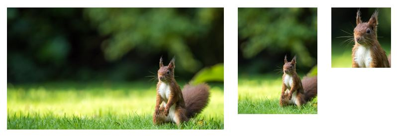
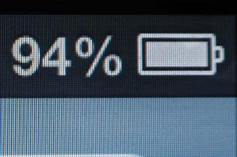
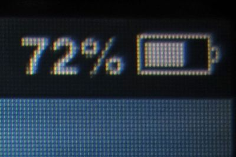
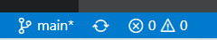
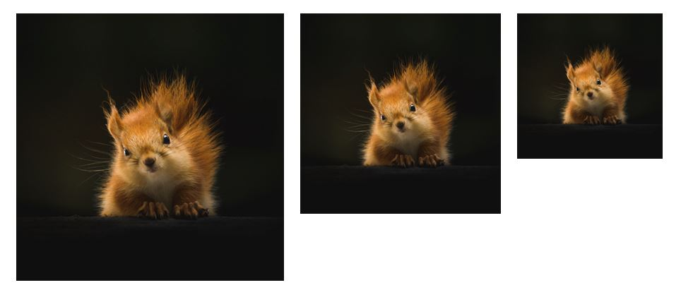
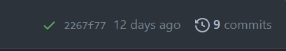

# Responsive images and SVG images

Learn how to do the following:

- Use the `<picture>` element to create a responsive image with art direction.
- Use an `` with `srcset` and `size` attributes to serve different image sizes for different screen widths.
- Use Dev Tools find images that are loading too slowly, and then learn to optimize them.
- Load an SVG image with ``.
- Use inline SVGs and create a `<symbol>` to easily reuse your inline SVG.

 ⚠️ This assignment builds on your _Semantic HTML and basic navigation_ assignment                                                                                                                                                                                                                                                                                                                                                                               |
| :-------------------------------------------------------------------------------------------------------------------------------------------------------------------------------------------------------------------------------------------------------------------------------------------------------------------------------------------------------------------------------------------------------------------------------------------------- |
| After cloning this repo and opening it in VSCode, copy the following files and folder from your _Semantic HTML and basic navigation_ assignment into this repo.<br><br><ul><li>📄 index.html</li><li>📄 favicon.ico</li><li>📁images</li><li>📁about</li><li>📁contact</li></ul><br>**Make sure that you don't copy any other folders or files, including the `test` and `readme-assets` folders, the hidden `.git` and `.github` folders, and the `package.json` files** |

## 📄 Add CSS files

In order for the images in this assignment to display properly, we need a little CSS. Load the `styles/main.css` file in the `<head>` section on all three of your html files.

| 💡 `<head>` contains info for the browser, not for the user. |
| :---------------------------------------------------------------- |
| Remember that the `<head>` section of an HTML file contains information for the browser, not for the user. This is where you add meta info about your site and load CSS (and, under certain conditions, JavaScript). Anything you want the user to "see" should be inside the  `<body>` tags. |

Add this to your main `index.html` file:

   `<link rel="stylesheet" href="styles/main.css">`

   And add this to your subpages (notice the relative path to the styles folder):

   `<link rel="stylesheet" href="../styles/main.css">`

## :art: Add a hero image using `<picture>`

A hero image is a large banner image that is displayed at the top of a webpage and is the first image visitors see. The actual image in a hero images should not include text. We will learn how to add text on top of our hero image in a later assignment.

For this assignment, place your hero image either above or below the header on your main `index.html` page.

A `<picture>` element allows for _art direction_, or different versions of images cropped to display best on different screen sizes and devices. Below is an example of images cropped to display on (from left to right) a laptop, a tablet, and a mobile phone.


### Determine the screen sizes and ratios

For this assignment we will create three versions of images for laptops, tablets, and mobile devices. There are no "set" widths or _aspect ratios_ (the width to height ratios) to use, but to keep it simple, you can follow these recommendations:

| Device | Max width | Suggested aspect ratio |
| ------ | --------- | --------------- |
| laptop | `2000px`  | 16:9            |
| tablet | `800px`   | 4:3             |
| mobile | `400px`   | 1:1             |

As discussed in class, the widths and aspect ratios are guides and it's best to test on actual devices to find an ideal max width and aspect ratio for each device-dependant layout. You are welcome to use different ratios based on your own preferences.

| ⚠️ Full screen images |
|:----------------------|
| If you'd like a full screen hero image (100% of the screen width and 100% of the screen height or  _viewport_), don't try to force the sizing with HTML or by cropping, as there are too many variations in screen sizes to make it work without CSS. After we learn CSS, you will learn how to properly display full screen images with `object-fit`.

---
### An aside: pixel ratios

 Pixel ratios are the number of physical pixels used to display one image pixel.

 We will keep this assignment simple and and ignore pixel ratios. However, if you continue in web development, you should be aware of pixel ratios.

To increase image sharpness, many devices use 2-4 physical pixels to display one image pixel. Apple's Retina display is so named because its screen pixels are supposedly too small to be seen by the human eye at a typical viewing distance. Below is an example of an iPhone 4 Retina display with a 2 pixel ratio:



Compare it to an iPhone 3GS with a 1 pixel ratio:


_Images from Wikipedia_

A Samsung Galaxy S8 has a pixel ratio of 4. While it advertises a screen width of 1440px, it's width for web design purposes is only 360 pixels (360 x 4 = 1440).

The image `srcset` attribute has pixel density descriptors that can detect pixel ratios and serve higher resolution images to devices with higher pixel ratios, but that is beyond the scope of the assignment.

To see the pixel ratio of your computer or device, check out [mydevice.io](https://www.mydevice.io/).

---

| ⚠️ Max image width of 2000 pixels |
|:---|
| For this class, assume a pixel ratio of 1 and a maximum viewport width of `2000px`. In other words, **make sure that none of your images are wider than `2000px`.**|

### Steps to create your hero `<picture>` element

1. Find a free high-resolution image for your hero image. You can search [Unsplash](https://unsplash.com/), [Pexels](https://www.pexels.com/), or another site of your choice &ndash; as long as the image you are using is copyright-free. You can't simply grab any image off a Google search, as those may have copyrights or usage restrictions. If you use your own image, make sure the image is at least `2000px` wide.
2. Use a photo editor, such as [befunky](https://www.befunky.com/create/), to crop and then resize your image to display on all three screen sizes. Make sure the cropping is obvious; I recommend cropping to different aspect ratios such as those suggest above, and then resizing them to the suggested width.
3. Save your images in the `images` folder. **In order for the auto-grader to detect that these are your hero images, you must begin the file names with** `hero`. Additionally, to make it easy for you to identify which image is which, I recommend appending the width to the image file name. For example, in the images above, I used the file names
   - `hero-squirrel-2000px.jpg`
   - `hero-squirrel-800px.jpg`
   - `hero-squirrel-400px.jpg`
4. In your main `index.html` file, add a `<picture>` element. To understand how the `<picture>` element works, watch the video below.

   | 🎥 WATCH: Dev Tools and `<picture>`                                                                                                                                                                                       |
   | :------------------------------------------------------------------------------------------------------------------------------------------------------------------------------------------------------------------------ |
   | Watch this 7 minute [video on using Dev Tools with the `<picture>` element](https://youtu.be/2jkA83w1ibc) to learn how to use the Network tab in Dev Tools to check that your `<picture>` element images are downloading correctly. I simplified the widths for this assignment, so don't be worried about image widths in the video not matching the ones in this assignment. |

   You can add the following HTML to your `index.html` file, but change the image file names and the `alt` attribute to accommodate your files:

   ```html
   <picture>
    <source media="(min-width: 801px)" srcset="images/hero-squirrel-2000px.jpg">
    <source media="(min-width: 401px)" srcset="images/hero-squirrel-800px.jpg">
    <source media="(max-width: 400px)" srcset="images/hero-squirrel-400px.jpg">
    
   </picture>
   ```

   Make sure to include a fallback `` with descriptive alt text. Since the `<picture>` element is used for art direction, the source image dimensions will not be the same, so you should not use `` `width` and `height` attributes as you would with single images.

### Use Live Server and Dev Tools to make sure your images are loading properly

Before you open your webpage in Live Server, check the bottom left info bar on VS Code. You want to make sure you don't have any errors or warnings which should look like this:



If you have errors or warnings, click on the icons to see what they are and fix them.

Once any problems are fixed, open Live Server and use the Dev Tools Network tab to make sure your images are loading properly.

## 📷 On your About page, add an `` with `srcset` and `size` attributes to serve different image sizes for different screen widths

While desktop computers can handle downloading large images, you don't want a user to waste bandwidth on a mobile device. You want to make sure that the image is downloaded at the right size for the device. This is where `` with `srcset` and `size` attributes come in.

Now, unlike the `<picture>` element, `` with `srcset` and `size` attributes are not art direction. They are used to serve different sizes of the same image. Also, unlike `<picture>`, `` with `srcset` and `size` does not guarantee a certain image will display at a given screen width. If the browser has a larger image cached, it will choose that instead.



Let's add an `` with different image sizes to our `about/index.html` page.

1. Find a free high-resolution image for your About page image. You can search [Unsplash](https://unsplash.com/) or [Pexels](https://www.pexels.com/). Let's keep the max width of this image at 900px.
2. Use a photo editor, such as [befunky](https://www.befunky.com/create/), to crop your image if desired, and then resize your image to be 900px wide. Save this image in the `images` folder. For convenience, append "-900px" to the image file name.
3. Resize the same image to 600px wide and then 300px wide, appending the widths to the files names. Save these images in the `images` folder.
4. Open your `about/index.html` file in VS Code. If you were simply loading the 600px wide image, you'd use this markup:

   ``

   but you would use your image file and a relevant `alt` attribute. Notice I've added the `width` and `height` attributes to the `` element to match the intrinsic dimensions of the image.

5. Next, let's add the other images using the `srcset` attribute. List the path to all the images and then follow each path with a _width descriptor_ which is the _intrinsic_ (actual) pixel width of the image (srcset can gets more complicated by accounting for pixel ratios, but we will keep this example as simple as possible). We added the width to the file name to help us keep the images separate, but the browser can't read that and needs you to let it know the width. Separate each path and width descriptor with a comma:

   ```html
   
   ```

6. Finally we need to add information to the `sizes` attribute. The sizes are relative to the browser viewport. The sizes will make more sense when you are able to use CSS to layout images.

   I added some CSS to force the image on the About page to always be 50% of the page width. We can let the browser know that instead of downloading an image that is the full width of the page, it should download an image that is half of the page width. Add the `sizes` attribute below to tell the browser the image will always be half the page width (or 50vw - viewport width). _We will learn more about this in the CSS lesson._

   ```html
   
   ```

   In this example, if your browser viewport is 1000px wide, the browser will look for an image that is at least 500px wide. If it encounters the HTML above, it will download the 600px wide image.

Open the Network tab in Firefox's Dev Tools and resize the window to see when the images download.

Chrome handles image loading a little differently and is more likely to reuse a larger image in the cache. Try viewing the Network tab in Chrome to see the difference.

| 📖 Learn more about srcset and sizes                                                                                                                                                                                                                                                         |
| :----------------------------------------------------------------------------------------------------------------------------------------------------------------------------------------------------------------------------------------------------------------------------------------------- |
| This example was simply to introduce you to `srcset` and `sizes`. The `srcset` attribute can detect pixel ratios and `sizes` can include media queries. Learn more at [MDN's The Image Embed element page](https://developer.mozilla.org/en-US/docs/Web/HTML/Element/img#attr-srcset) |

## ⏱️ Check image file sizes and load times

Images that take too long to download can impact SEO and user experience. Even if an image is resized to 2000px or less, the image file can still be too large and slow your page's load time. There are no set rules for how large image files should be, but I recommend making sure they are less than 1MB, if possible.

| 🎥 Dev Tools and image download time |
|:---|
| Watch this 7 minute video I recorded, [Dev Tools and image download time](https://youtu.be/oGgSqT6-KNo) to learn how to use the Network tab in Dev Tools to check image load times and also how to decrease image files sizes using an image editor or [TinyJPG](https://tinyjpg.com/). |

## 💹 Add SVG images

### Add an SVG image to your contact page using ``

SVG images can be loaded on a web page just like PNG and JPG files.

1. Find a free SVG image on a site such as [IconFinder](https://www.iconfinder.com/search?q=form&price=free) (make sure to filter for free icons), [unDraw](https://undraw.co/illustrations), [Lukasz Adam](https://lukaszadam.com/illustrations) or another resource.
2. Make sure that the image has an `.svg` extension and save the SVG image file in your `images` folder.
3. On your contact page, add an `` element to load your SVG file. Use a relative path in the `src` attribute and don't forget to add an `alt` description.

| 💡 Optional: optimizing SVG files with SVGO |
|:---|
| Many SVG files generated by illustration programs can contain extra, unnecessary info which increases the file size. Large websites can use a utility called [SVGO](https://github.com/svg/svgo) (SVG Optimizer) to automate cleaning up of SVG files. I frequently use the web app version of it, [SVGOMG](https://jakearchibald.github.io/svgomg/) to clean up SVG files. It's totally optional, but I wanted to make you aware of the resource. If you have to work with a lot of SVG files, it's very helpful.   |

### Add a simple inline SVG image to your main page using `<symbol>`

You can use the inline SVG you wrote for the [inline SVG learning task](https://codepen.io/lsburton/pen/yLXvxJq). It can be as simple as a circle, although many students create a "hamburger" menu icon to use for our mobile menu assignment at the end of the semester. The location of the SVG isn't important, as long as it is visible on the main `index.html`.

Refer to the assigned reading [SVG intro](https://codepen.io/lsburton/pen/ZEBYbXw?editors=1100) for more information on inline SVG and `<symbol>`.

### Use Live Server to make sure your images are displaying properly

Before you open your webpage in Live Server, check that you don't have any errors or warnings. If you have errors or warnings, fix them.

If everything looks good, then....

## :arrow_up: Use VS Code's Source Control (in the sidebar) to commit your changes and sync these changes to Github

### 🚀 Publish your web page on Github Pages

Open your repo on Github. Publish your site on GitHub pages.

### Enter your repo about information

In your main repo page edit the About section. Enter a description of your repo and add your Pages URL in the **Website** text field.

## Validate your HTML with validator.nu

Once your page is live, use the [validator.nu](https://validator.nu/) service to validate the HTML on all three of your web pages (main, contact, about). Select Show "outline" and "image report" then paste your page URL into the validator and click Check.

Check that each image has a valid alt attribute.

If you have any errors, fix them in VSCode, commit and sync, and then re-validate your page. Make sure to wait a few minutes for Github to generate the updated page.

## Pass automated tests

After you've ensured that your page has validated, open your repo in Github and check that you've passed the automated tests. Look at the top right of your repo header. If you have passed all the tests, you'll see a green check mark:



If you failed any tests, you will see a red X. Click on the X to see which test failed. Click on the failed test name for more details.


If you see a yellow dot, it means that the test is still running. Wait for the test to finish.

### Current automated tests

- HTML validation
- HTML proofer

Pretests (25):

- General HTML structure
  - REQUIRED `<head>` INFO
    - main index.html has `<title>`, `<meta>` description and favicon info
    - about index.html has `<title>`, `<meta>` description and favicon info
    - contact index.html has `<title>`, `<meta>` description and favicon info
  - STYLESHEETS LOADED
    - main index.html loads styles/main.css
    - about index.html loads styles/main.css
    - contact index.html loads styles/main.css
  - ONLY ONE `<h1>` IN AN HTML FILE
    - main index.html contains exactly one `<h1>`
    - about index.html contains exactly one `<h1>`
    - contact index.html contains exactly one `<h1>`
  - MAIN MENU
    - main index.html has a `<header>` containing a `<nav>` and a `<ul>`
    - about index.html has a `<header>` containing a `<nav>` and a `<ul>`
    - contact index.html has a `<header>` containing a `<nav>` and a `<ul>`
    - main index.html - relative paths used in main menu; paths do not end with 'index.html'
    - about index.html - relative paths used in main menu; paths do not end with 'index.html'
    - contact index.html - relative paths used in main menu; paths do not end with 'index.html'
- Image tests
  - image paths are all lowercase and contain no spaces
  - images must be 1920px wide or less
  - relative paths to images used, and images must be in the images directory
  - non-SVG and non-`<picture>` `` height and width attributes set to the image's intrinsic dimensions
  - `<picture>` element must contain three `<source>` elements with media and srcset attributes
  - about page includes an `` element that uses `srcset` and `sizes` to load three versions of the same image with different widths
  - contact page loads an SVG file with ``
- MAIN index.html ONLY
  - main index.html must contain a `<picture>`, one `<main>`, at least two `<article>`, an `<aside>`, and a `<footer>`
  - main index.html includes a simple inline SVG image displayed using `<symbol>`
  - `<article>` must contain an `<h2>` and at least one `<p>`

## Submit your repo URL on Slack

When you are ready to have your assignment graded, DM me your repo (not web page) URL on Slack.
